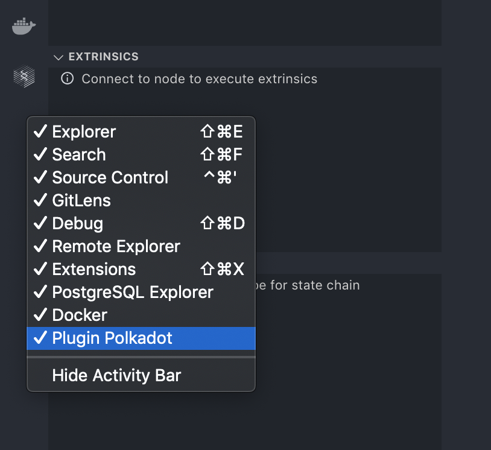
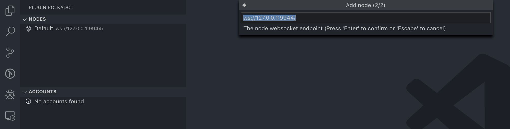
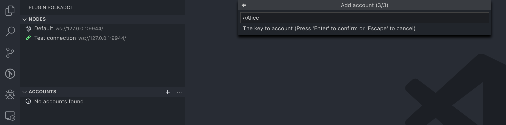
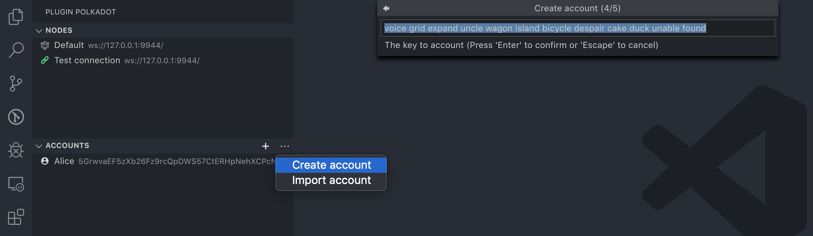

<h1 align="center">Plugin Tutorial</h1>

With this file, you will learn how to use this plugin and the main features of it.

## Prerequisites

To start using this extension - install it from [marketplace](). It will install [substrate](https://www.parity.io/substrate/) if it's not yet installed.

## Demo

Let’s go through the plugin main features and see what’s happening.

### Step 1: Install and start plugin

To start using this extension - you can install it from [marketplace](https://marketplace.visualstudio.com/items?itemName=enfipy.plugin-polkadot). For this extension to work properly, the following prerequisites are required:

1. Visual Studio Code v1.37.0+
2. Installed [plugin dependencies](../README.md#plugin-dependencies)

To compile this plugin from sources you need following:

1. Visual Studio Code v1.37.0+
2. Installed [plugin dependencies](../README.md#plugin-dependencies)
3. Yarn v1.13.0+
4. Installed [Substrate](https://substrate.dev/docs/en/getting-started)

To compile this plugin:

```bash
$ git clone https://github.com/everstake/VSCode-Atom-Plugin.git vscode-substrate
$ cd vscode-substrate
$ yarn install
```

To run new instance of VSCode with installed plugin - press `F5` or click on the dubug icon (or `SHIFT + CMD + D`), choose `Run Extension` at the top of the panel and then click on green button.


### Step 2: Run node locally

After installation or run from sources you will see icon on the right sidebar. If you don't see the icon - probably plugin not installed correctly or it's icon hidden. To show icon - click on the right sidebar and select `"Plugin Polkadot"`.



Open (or [clone](https://github.com/paritytech/substrate#51-on-mac-and-ubuntu)) substrate node (with `balances` SRML to complete this tutorial) in VSCode editor.

When your open your node sources let's start it from plugin. On the top panel `"NODES"` click `"..."` and `"Start local node"`. If you see compilation logs in the terminal - you are compiling node and have to wait for its to finish.


### Step 3: Connect to node

After successful compilation of node you can connect to it to see it's extrinsics, chain states and more.

In panel `"NODES"` by default plugin will add local node connection but if you want to create new click on the `"+"` button and type the name of node connection with it's local address (by default `"ws://127.0.0.1:9944/"`).



After add connection let's connect to it via right click on it and choose `"Connect..."` option. After successful connection you will see extrinsics and chain states of connected node.


### Step 4: Add first account

After successful connection let's add an account in our plugin. To add account with it's mnemonic/seed/uri click in `"ACCOUNTS"` panel on the `"+"` button. Type in the inputs following data: name of account, crypto curve type and mnemonic/seed/uri.



### Step 5: Create our own account

Now let's create a new account in our plugin. To create new account with it's mnemonic/seed and encrypt with password click in `"ACCOUNTS"` panel on the `"..."` button and select option `"Create account"`. Type in the inputs following data: name of account, crypto curve type and private key type (mnemonic or seed), private key, password.


